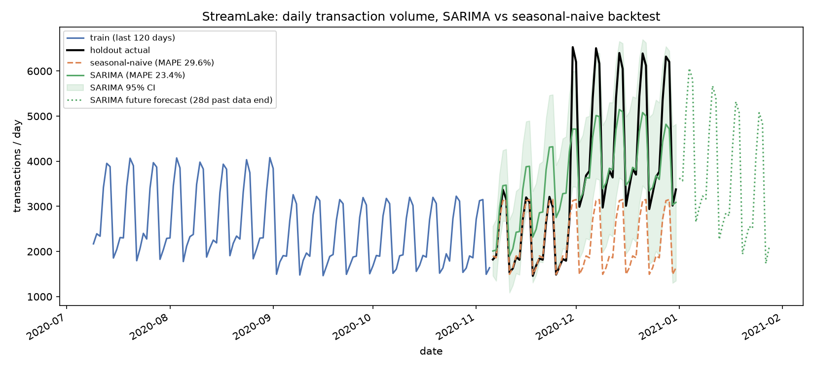

# StreamLake

A streaming lakehouse for card-transaction fraud data, with a data contract checked at every hop.

The data is Sparkov, a synthetic card feed (Faker-generated, Jan 2019 to Dec 2020). It gets
ingested two ways, a batch job and a live Kafka stream, into an Apache Iceberg lakehouse, modelled
into a warehouse with dbt, and served through a dashboard. Airflow runs the batch job on a
schedule. Before each hop is allowed to read the previous one, a contract checks the data and fails
the run if it does not hold.

```
                    ┌──────────────────────────────────── contracts run here ─┐
                    ▼            ▼             ▼            ▼            │
  Sparkov ──▶ bronze ─▶ silver ─▶ gold ─▶ curated ─▶ DuckDB/Snowflake ─▶ dbt ─▶ dashboard
  CSV         (raw PII)  (masked,  (fraud    parquet     warehouse         marts
                          deduped)  KPIs)

  producer ──▶ Kafka ─┬▶ Structured Streaming ──▶ stream.txn_metrics_1m
                      │  (1-min windows, 2-min watermark, dedup, MERGE)
                      └▶ fraud scorer ──────────▶ stream.txn_decisions
                         (per-transaction approve / review / decline)
```

Everything runs on a laptop for free: Iceberg on MinIO (one Docker container, S3-compatible), a
single Kafka container, DuckDB as the warehouse. The same code runs against real AWS S3, a real
Kafka, and Snowflake by changing environment variables. Nothing is hardcoded to the local setup,
and both the MinIO and Snowflake swaps have actually run, not just been written.

## What ran

Most numbers here come from the batch run committed in `_reports/` and `dashboard/build/index.html`.
The scoring row comes from `scripts/train_scorer.py` and a live Kafka run of the streaming scorer.

| | |
|---|---|
| Source | Sparkov card transactions, train and test combined, **1,852,394 rows**, ~506 MB CSV |
| Quarantined | **0 rows.** Sparkov is a clean synthetic feed. The quarantine rules run on every row and found nothing, which a real card feed would not do |
| Silver | 1,852,394 rows, one per `trans_num`, PII masked, 14 contract checks |
| Gold | 5 fraud KPI tables: category-hour, state-hour, card velocity, merchant risk, fraud-vs-legit distance |
| Warehouse | 5 staging views, 5 marts, **44 dbt tests green on DuckDB, 44 green again on real Snowflake** |
| Contracts | 7 contracts, 49 checks, 0 errors, 0 warnings |
| Unit tests | **67 passed**, real local Spark, no mocks |
| Streaming | 20,985 events produced (985 of them duplicates), **20,000 counted**. The dedup removed exactly the 985 |
| Real-time scoring | Logistic-regression fraud scorer, **out-of-time ROC-AUC 0.8503, PR-AUC 0.1081** on the test split. A live 3,130-event Kafka run scored 3,000 transactions into `stream.txn_decisions` (28 decline, 647 review, 2,325 approve); the 130 duplicates were deduped, not scored twice |
| Fraud rate | 0.521% (9,651 of 1,852,394) |
| Object storage | Bronze landed on MinIO as 739 real S3 objects (147 MiB), read back with `mc ls` / `mc du` |
| Snowflake | Live trial account: all 9 curated tables reconciled, `dbt build --target snowflake` ran 44 tests green in 10.7s |

The default `make stream` can only prove the dedup path, not the late-arrival drop. It runs the
producer to completion before the consumer starts, so every event is already in the topic when the
consumer subscribes and nothing is late relative to a watermark that has not moved yet. To prove
the drop I wrote a separate demo that interleaves the two. See "Proving the late-arrival drop"
below.

## Quick start

Needs Docker, JDK 17 (`export JAVA_HOME=$(/usr/libexec/java_home -v 17)`; Spark 4 does not run on
JDK 25), Python 3.11 or 3.12, and [uv](https://docs.astral.sh/uv/).

```bash
make setup          # virtualenv + dependencies
make batch          # ingest → bronze → silver → gold → export → warehouse → dbt  (~3 min, first run downloads ~506 MB)
make stream         # Kafka up, produce events, consume into Iceberg              (~2 min)
make dashboard      # render the dashboard
open dashboard/build/index.html
```

Every hop runs on its own too (`make silver`, `make gold`, and so on) and prints its contract
results as it goes. `make help` lists all targets.

```bash
make test       # 67 unit tests, real local Spark
make lint       # ruff + dbt parse
make contracts  # print what every contract asserts
make clean      # delete generated data, keep the source download
```

## The idea

Most pipelines fail silently. The job succeeds, the dashboard renders, and the number is quietly
wrong because a vendor renamed a column or last night's load only got half the rows. On a fintech
feed there is a worse version: the job succeeds and a cardholder's name or card number ends up in a
table nobody meant to put it in. Nothing in the stack notices either one on its own, so the first
person to catch it is a stakeholder or an auditor.

StreamLake puts a contract at every hop: a YAML file next to the pipeline that says what the
dataset must look like, checked before the next hop reads it. On silver, the contract's strict
schema doubles as a PII gate. Any column not on the declared list, `cc_num`, `first`, `last`,
`street`, `dob` among them, fails the run.

```yaml
# conf/contracts/silver_transactions.yml (excerpt)
schema:
  strict: true      # cc_num, first, last, street, dob are not declared, so if any
                    # of them reappear, the contract fails the run
  columns:
    - name: cc_num_hash
      type: string
      nullable: false

checks:
  - type: unique
    columns: [trans_num]        # the dedup guarantee: makes a re-run safe and makes
                                # the Kafka arm's at-least-once delivery harmless
  - type: accepted_range
    column: cardholder_age
    min: 0
    max: 100
    severity: warn              # a data-quality signal, not a reason to stop
```

An `error` breach raises, the task fails, the DAG stops, and the warehouse keeps serving
yesterday's correct data instead of today's broken data. A `warn` breach is recorded and shown on
the dashboard.

A few things about the engine are worth knowing. It makes one validation pass per hop: every check
compiles to a Spark aggregate expression and they all run in a single `df.agg(...)`. Validating
silver's 14 checks over 1.85M rows took about 3.6 seconds. Only a check that actually flags rows
pays for a second pass to collect examples, and none did here.

Quarantine and the contract work at different levels. Silver moves individual malformed rows to
`silver.transactions_quarantine` tagged with the rule that rejected them, so "where did my
transactions go?" has an answer you can query. The contract sits on top as a dataset-level gate: if
quarantine swallows more than 10% of the data, the whole run fails even though every surviving row
is clean. On Sparkov that budget has never come close, but the rules are there for the day the
source is swapped for a messier one.

Freshness is checked against the logical run time, not wall clock. A backfill of 2019-2020 data run
today still passes, because the check asks whether the data covers the period it claims to, not
whether it landed recently.

## Data governance: PII

Bronze is an unmodified copy of the source, `cc_num`, `first`, `last`, `street`, `dob` all in
plaintext, for every row. That is standard medallion design. Bronze is what you replay from when a
downstream rule turns out to be wrong, and a bronze layer that already dropped a field cannot be
replayed to fix a rule that needed it. Sparkov is synthetic, so no real person is in the table, but
the pipeline is written as if it were real. That is the only way the masking actually gets
exercised instead of just claimed.

The masking happens once, at the bronze-to-silver hop, in `src/streamlake/transforms.py`. Nothing
past silver ever sees the raw fields:

- `cc_num` (the full card number) is dropped. It is replaced by two columns: `cc_num_last4` for
  display, and `cc_num_hash`, a salted SHA-256 of the card number that `mask_card_number()` computes
  as `sha2(concat(salt, cc_num), 256)`. The salt comes from the `STREAMLAKE_PII_SALT` environment
  variable (with a local-dev default when unset), so the hash is not reversible by pre-computing a
  rainbow table over the ~10^16 possible card numbers. The hash is stable across ingestions, which is
  what lets `gold.card_velocity` count transactions per card over a rolling window without the card
  number itself ever landing in a table past bronze.
- `first`, `last`, `street` are dropped. No KPI here needs them.
- `dob` is dropped and replaced by `cardholder_age`, a derived integer, which is useful for analysis
  and reveals far less than a birth date (date of birth plus zip plus gender is a classic
  re-identification vector).
- The cardholder's home coordinates (`lat`, `long`) are turned into `distance_km` and then dropped.
  The merchant's coordinates are a business location, not a person, so they stay.

Enforcement is the strict silver contract (`conf/contracts/silver_transactions.yml`), not trust in
the transform. Its schema is declared `strict: true` and lists exactly the columns silver is allowed
to have; `cc_num`, `first`, `last`, `street`, `dob` are not among them. If a future change to
`transforms.py` let one of those columns survive to silver, the schema check finds an undeclared
column and fails the run, instead of quietly leaking it downstream. The masking and the gate live in
two different files on purpose: the transform can be edited by mistake, the contract is what catches
the mistake. The streaming arm never touches raw PII either: the producer replays from the curated
export, which is already past this hop, so no card number, name, or address ever reaches Kafka.

## Proving the late-arrival drop

`scripts/demo_late_arrivals.py` interleaves the producer and consumer so a genuinely late event
arrives after the watermark has passed it and gets dropped. It:

1. Delete and recreate a dedicated Kafka topic (`streamlake.transactions.latedemo`) and the
   sink table, so every run starts from a genuinely empty backlog. This step is required, not
   cosmetic: dropping the sink table and clearing the checkpoint alone is not enough, Kafka keeps
   every message a previous run sent, and without deleting the topic a second run replays that
   whole backlog on top of its own data and the reconciliation breaks. (This was caught by
   actually running the script twice in a row during review, not by reading the code.)
2. Start the consumer, subscribed against the now-empty topic.
3. Produce an on-time batch and wait for its micro-batch to commit, which is what advances the
   watermark to `max(event_ts seen) - 2 minutes`.
4. Produce a second batch stamped `--force-late-seconds 600` (ten minutes behind wall clock,
   deterministically, not the usual randomised 60-240s jitter), which arrives after the watermark
   has already passed it and gets dropped by Spark's own watermark logic before it ever reaches
   the aggregation.
5. Read back what the producer actually sent, what Spark's own state-operator metrics recorded,
   check the reconciliation identity, then **independently** query the sink table's own
   `sum(txns)` in a fresh Spark session, after the streaming query has stopped, a different code
   path than the metrics being checked against it, and confirm the two agree.

Run it yourself (uses Docker Kafka; `make kafka-up` first):

```bash
.venv/bin/python scripts/demo_late_arrivals.py   # make kafka-up first
```

It exits non-zero if the identity does not hold, if the independent sink query disagrees, or if
nothing was actually dropped as late. Numbers from a real run:

```
produced = 1,568 (on time) + 500 (late) = 2,068
consumer numInputRows                    = 2,068
  dedup_removed  (state operator)        = 68
  late_dropped   (state operator)        = 500
  => counted (input - dedup - late)      = 1,500
sink table sum(txns), queried independently after the run = 1,500   MATCHES
identity: 2,068 == 1,500 + 68 + 500   holds
```

Getting the *counting* right took a second pass of its own: the first version of the
reconciliation script misread which JSON field on which Spark state operator meant "duplicate
removed" versus "dropped for lateness" (both live on the same operator, split by field name, not
operator name). Found by dumping the raw progress JSON from a real run instead of trusting memory
of the Spark docs.

## Real-time fraud scoring

The windowed consumer answers "what is the fraud rate this minute". A payment switch needs the other
question answered per transaction, live: approve this charge, hold it for review, or decline it.
`src/streamlake/stream/scorer.py` is that path. It reads the same Kafka topic and the same event
schema the metrics consumer does, scores every event through a fraud model, and writes one decision
row per transaction to an Iceberg table, `stream.txn_decisions`.

The model is a scikit-learn logistic regression over four features that are already on every event:
the amount (log-compressed, since amounts are heavily right-skewed), the cardholder-to-merchant
distance, the transaction hour, and the category (one-hot). Those are the same silver-layer fields
`transforms.py` computes, so scoring reuses the batch pipeline's own features rather than inventing
new ones. All of it lives in `src/streamlake/scoring.py`, imported by the trainer, the unit test, the
in-process demo, and the streaming job, so a transaction scored live off Kafka goes through exactly
the same feature derivation and thresholds as one scored offline. The label `is_fraud` is used only
to fit and to evaluate; it is never a model input, because a live event does not carry one.

A logistic regression, not a gradient-boosting model, on purpose: the point here is the end-to-end
path (event in, decision out, one definition shared across batch and stream), and a linear model is
enough to prove it on Sparkov while staying trivially serialisable and fast enough to score a Kafka
micro-batch. The heavier fraud model belongs in a separate project.

**Training and honest numbers.** Sparkov ships as a time-split train file and test file, and the
curated export keeps that split. `scripts/train_scorer.py` fits on the `train` rows (1,296,675 rows,
0.579% fraud) and evaluates on the `test` rows (555,719 rows, 0.386% fraud), so the accuracy below is
out-of-time, scored on a period the model never saw while fitting:

| | value |
|---|---|
| ROC-AUC (test split) | **0.8503** |
| PR-AUC (test split) | **0.1081** |
| Decline threshold | 0.867 (99th percentile of train scores) |
| Review threshold | 0.637 (90th percentile of train scores) |

The two thresholds are a policy, set on the training scores, not fitted: auto-decline the riskiest
~1%, send the next ~9% to human review, auto-approve the rest. On the held-out test split that policy
declines 5,008 transactions (16.9% of them actually fraud), reviews 50,083, and together the two
flagged bands catch 1,521 of the 2,145 real frauds, a recall of 70.9% while touching under 10% of all
transactions. PR-AUC of 0.108 is low in absolute terms and is reported as-is: fraud is 0.4% of the
feed and a linear model on four features is not going to do better than this without more signal. The
number is honest, not flattering.

Run it:

```bash
make batch                                    # produces data/curated, the training source
python scripts/train_scorer.py                # fits the model, prints the numbers above
python scripts/demo_realtime_scoring.py       # in-process: real events in, decisions out
```

`demo_realtime_scoring.py` replays real curated transactions as event dicts (the exact payload the
Kafka producer emits) and prints each one's decision next to its true label, no broker needed. The
full streaming path against a live Kafka broker:

```bash
make kafka-up
make produce                                  # replay transactions onto the topic
make score-stream                             # Spark reads Kafka, scores, writes stream.txn_decisions
```

This ran end to end on a local Docker Kafka: 3,130 events produced (130 of them duplicates), the
watermark deduped the 130, and the scorer wrote 3,000 decision rows (28 decline, 647 review, 2,325
approve). The decline list was topped by an $11,960 travel charge at fraud probability 0.993. On that
first-3,000-row slice the flagged bands caught 15 of 31 frauds (48%); the 70.9% recall above is the
number that matters, measured on the full held-out test split rather than one small live batch.

`stream.txn_decisions` is the sink. Emitting the same decisions to a Kafka output topic is a one-line
`writeStream.format("kafka")` swap on the same DataFrame; the Iceberg table is used here because it is
queryable after the run without a second consumer.

## Forecasting daily transaction volume

`forecast/` is a small standalone module on top of the gold layer, no Spark needed. Two gold tables
are already plain Parquet after `make batch`, so `build_series.py` rolls both up to one row per day
with pandas and checks their daily totals agree (they are two independent group-bys over the same
silver table). The one gap in the 731-day span, 2020-02-29, has zero transactions in the raw source
(checked with `grep -c` against both CSVs), so it is kept as a real zero, not interpolated.

The baseline is seasonal-naive: repeat the last 7-day block across the whole horizon, the textbook
version (Hyndman & Athanasopoulos), not a walk-forward that peeks at the holdout.

The model is SARIMAX(1,1,1)x(1,1,1,7) plus 5 annual Fourier harmonics. A weekly-only SARIMA came
first and barely beat the baseline (29.1% vs 29.6% MAPE). The reason is a sharp December volume
surge, roughly double a normal month, that repeats in 2019 and 2020, which a weekly model cannot
see coming. Adding harmonics of the annual cycle as exogenous regressors gives it that signal
without a `seasonal_order` of 365, which statsmodels cannot fit on daily data. The harmonic count
(K=5) was picked on a separate validation split inside the training span, never on the holdout, so
the number below is not the one that tuned the model.

Backtest: last 56 days held out (2020-11-06 to 2020-12-31), both models fit once on the other 675
days. From `make forecast`:

| | MAPE | MAE |
|---|---|---|
| Seasonal-naive (baseline) | 29.625% | 1,329 txns/day |
| SARIMA + annual Fourier | **23.414%** | **698 txns/day** |

MAPE down 6.2 points (21% relative), MAE almost halved. Both are backtest output, not fit
statistics. The chart shows the holdout actuals, both forecasts, the SARIMA 95% interval, and a
28-day extrapolation past the end of the data that has no ground truth to score against.



## The three layers

**Layer 1, batch** (`src/streamlake/batch/`): ingest → bronze → silver → gold → export. Bronze is a
copy of the source plus lineage columns, raw PII included. Silver conforms names and types, masks
the card number, drops name/street/dob, turns home coordinates into a distance, quarantines invalid
rows, and dedupes on `trans_num`. Gold builds five fraud KPIs: fraud rate by category and hour,
volume by state and hour, a rolling 7-day card velocity, a merchant risk leaderboard (min-volume
gated), and a fraud-vs-legit distance table. Tables are Iceberg, partitioned by day, written with
dynamic partition overwrite so a re-run replaces rather than appends.

**Layer 2, streaming** (`src/streamlake/stream/`): Kafka → Structured Streaming → Iceberg. The
producer replays curated transactions (already past silver, so no raw PII reaches the topic) with a
fresh `event_ts`, and misbehaves on purpose: about 5% of events sent twice, about 3% a little late,
which gives the consumer's dedup and watermark something to do. The consumer uses a 2-minute
watermark, `dropDuplicatesWithinWatermark(["trans_num"])`, 1-minute windows, and a `MERGE INTO`
sink rather than an append, since update mode re-emits a window every time it changes. Contracts run
inside `foreachBatch` before the merge, so a bad batch never advances the Kafka offsets. This is not
exactly-once delivery. It is Kafka's at-least-once plus a watermark-bounded dedup, which gives the
same result as long as a redelivery lands inside the 2-minute window.

**Layer 3, serving**: dbt marts on DuckDB (or Snowflake, same models, `DBT_TARGET` picks the
engine), a static self-contained dashboard, and Terraform plus Kubernetes manifests for the
consumer. The dbt layer recomputes Spark's category/hour fraud aggregate in warehouse SQL on
purpose, and `tests/assert_batch_spark_dbt_parity.sql` compares every shared column of the two
rebuilds and fails the build if they drift past last-digit rounding. Duplicating the logic is the
point: it turns silent drift into a red test.

## Pointing it at real infrastructure

Every knob is an environment variable. Copy `.env.example` to `.env` and source it.

**MinIO, then real S3.** MinIO is already wired into `docker/docker-compose.yml`, so the default
demo never hits the network for storage. This ran end to end: bronze, 1,852,394 rows, both contracts
green, 739 objects / 147 MiB in the bucket, verified with `mc ls` / `mc du`.

```bash
make minio-up
export ICEBERG_WAREHOUSE=s3a://streamlake/warehouse
export AWS_S3_ENDPOINT=http://localhost:9000
export AWS_S3_PATH_STYLE=true
export AWS_ACCESS_KEY_ID=minioadmin AWS_SECRET_ACCESS_KEY=minioadmin
export SPARK_EXTRA_PACKAGES="org.apache.iceberg:iceberg-aws-bundle:1.11.0,org.apache.hadoop:hadoop-aws:3.4.1"
make bronze
```

Two jars, not one, turned out to be necessary. `iceberg-aws-bundle` gives Iceberg's own
`S3FileIO` (table *data* files) the AWS SDK v2 client; skip it and Spark fails immediately with
`UnsupportedFileSystemException`. `hadoop-aws` gives Hadoop's generic `FileSystem` abstraction an
S3A handler, a `hadoop`-type Iceberg catalog still uses **Hadoop's** filesystem, not Iceberg's
`S3FileIO`, for namespace and table-directory operations, a different client with its own
credentials (`spark.hadoop.fs.s3a.*`, set by `_hadoop_s3a_conf()` in `src/streamlake/spark.py`).
Skip either piece and the run gets partway before failing with a confusingly unrelated-looking
error that points nowhere near the missing jar.

The swap to real S3 is the same variables pointed differently: unset `AWS_S3_ENDPOINT`, point
`ICEBERG_WAREHOUSE` at a real bucket, set real credentials and `AWS_REGION`. No code changes. I have
not run this against a real bucket to avoid the AWS bill. MinIO is what proved the connector
config works.

**Snowflake instead of DuckDB.**

```bash
export WAREHOUSE_TARGET=snowflake DBT_TARGET=snowflake
export SNOWFLAKE_ACCOUNT=... SNOWFLAKE_USER=... SNOWFLAKE_PASSWORD=...
export SNOWFLAKE_DATABASE=STREAMLAKE SNOWFLAKE_SCHEMA=RAW
uv pip install -e ".[snowflake]"
make warehouse dbt
```

The loader stages the curated Parquet and `COPY INTO`s with `MATCH_BY_COLUMN_NAME`, so the table is
defined by the Parquet schema instead of hand-written DDL that drifts from the lake. Verified on a
live trial account: all 9 curated tables staged and reconciled (the 1.85M-row table included) and
`dbt build --target snowflake` ran 44 tests green in 10.7s. Day to day, `make batch` still uses
DuckDB.

**Kubernetes and Airflow.**

```bash
make kind-up && make kind-load && make k8s-apply    # local kind cluster, kustomize manifests
make tf-init && make tf-plan && make tf-apply        # same objects via OpenTofu

export AIRFLOW_HOME=$PWD/airflow/home AIRFLOW__CORE__DAGS_FOLDER=$PWD/airflow/dags
.venv-airflow/bin/airflow dags test streamlake_batch  # whole batch DAG, no scheduler
```

Airflow lives in its own venv, since its pins conflict with the pipeline's, and its tasks shell out
to the `streamlake` CLI rather than importing PySpark into the scheduler.

**Databricks (`databricks/streamlake_batch_databricks.py`).** The batch spine ported to a Databricks
notebook: the same column renames, PII masking, quarantine rules, five gold aggregates, and the whole
YAML contract engine, copied rather than rewritten. Three things change because they are properties of
the local environment, not the transforms: it uses the notebook's own `spark` session, writes Delta
tables instead of Iceberg (Free Edition has Delta built in and no Iceberg catalog), and reads the
Sparkov CSVs from DBFS. The six embedded contract specs were diffed field-by-field against
`conf/contracts/*.yml` and match on everything that affects enforcement. The notebook's logic was
smoke-tested locally against an 8,000-row-per-file sample with real Spark; it has **not** been run on
a real Databricks cluster against the full 1.85M rows, and it says so at the top of the file rather
than implying a run happened.

**Tableau (`tableau/`).** `tableau/export_extracts.py` is a single pandas pass over the same
1,852,394-row curated export the warehouse reads. It writes five CSVs (fraud rate over time, fraud by
category, fraud by state, volume by hour, volume by day of week) for a Tableau Public workbook. The
extracts are real aggregates and reconcile to the "What ran" table (1,852,394 txns, 9,651 fraud,
0.521%). The workbook itself is built in Tableau's GUI, which has no headless path, so the CSVs and
the exporter are what live in the repo.

## When it breaks

**Reflection errors on startup.** Wrong JDK. `export JAVA_HOME=$(/usr/libexec/java_home -v 17)`.
Spark 4 does not run on JDK 25.

**`PYTHON_VERSION_MISMATCH`.** Spark launched workers with the system `python3`. `build_spark()`
pins `PYSPARK_PYTHON` to `sys.executable`; do the same if you make a SparkSession outside it.

**Streaming `UnknownTopicOrPartitionException`.** The topic does not exist. Broker auto-create does
not help, since Spark asks the admin API before producing. Create it first with `kafka-topics.sh
--create`.

**`quarantine rate X% exceeds the 10% budget`.** Silver refused to promote. Query
`lakehouse.silver.transactions_quarantine` grouped by `reject_reason`. On Sparkov this has always
run at 0%.

**Two consumers, one checkpoint.** Structured Streaming locks the checkpoint directory and the
second query dies. `replicas: 1` in Kubernetes and `max_active_runs=1` in Airflow are both
deliberate.

## Repository map

| Path | What is in it |
|---|---|
| `conf/contracts/` | The contracts. Start here, they describe the data better than the code does. |
| `conf/reference/category_channel.csv` | Sparkov's 14 categories mapped to card-present or not, from their own `_net`/`_pos` naming. |
| `src/streamlake/contracts/` | The contract engine: spec parsing, checks, runner, reports. |
| `src/streamlake/batch/` | Ingest, bronze, silver, gold, export. |
| `src/streamlake/stream/` | Kafka producer, the windowed metrics consumer, and the real-time fraud scorer. |
| `src/streamlake/scoring.py` | The fraud model and the approve/review/decline decision policy, shared by the trainer, the demo, the test, and the streaming scorer. |
| `src/streamlake/transforms.py` | Logic shared by both arms: PII masking, distance, validity rules. |
| `scripts/demo_late_arrivals.py` | The interleaved demo that proves the watermark's drop path. |
| `scripts/train_scorer.py`, `scripts/demo_realtime_scoring.py` | Train the scorer from curated data; replay real events through it and print decisions. |
| `dbt/streamlake/` | Staging views, marts, generic tests, the cross-engine parity test. |
| `airflow/dags/` | The nightly batch DAG and the streaming supervisor DAG. |
| `infra/` | Terraform module and kustomize manifests. |
| `docker/` | Kafka/MinIO compose stack and the consumer image. |
| `forecast/` | The daily volume series builder and the SARIMA-vs-baseline backtest. |
| `databricks/` | The batch spine ported to a Databricks notebook (Delta instead of Iceberg, same transforms and contracts). |
| `tableau/` | Five gold/silver CSV extracts and the pandas exporter that builds them, for the Tableau Public workbook. |
